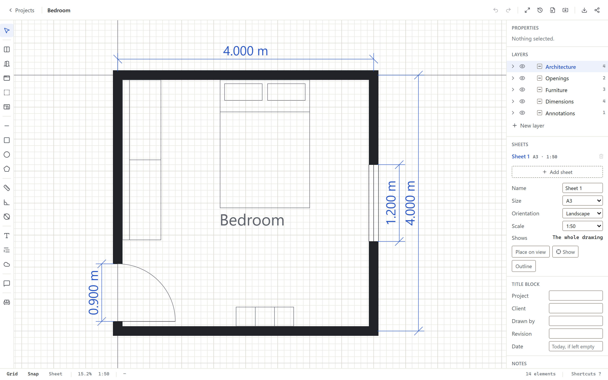
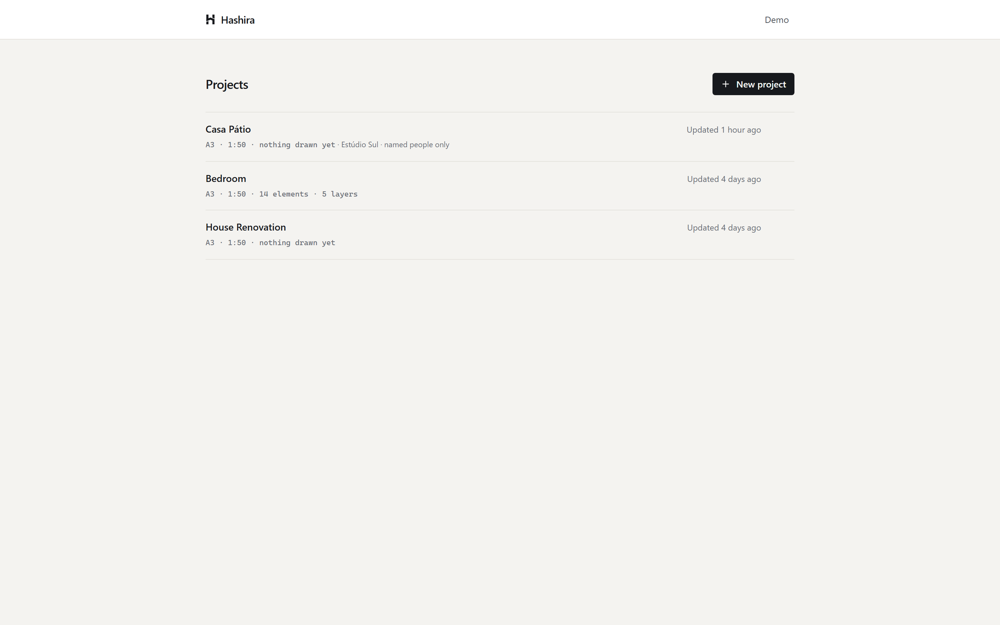
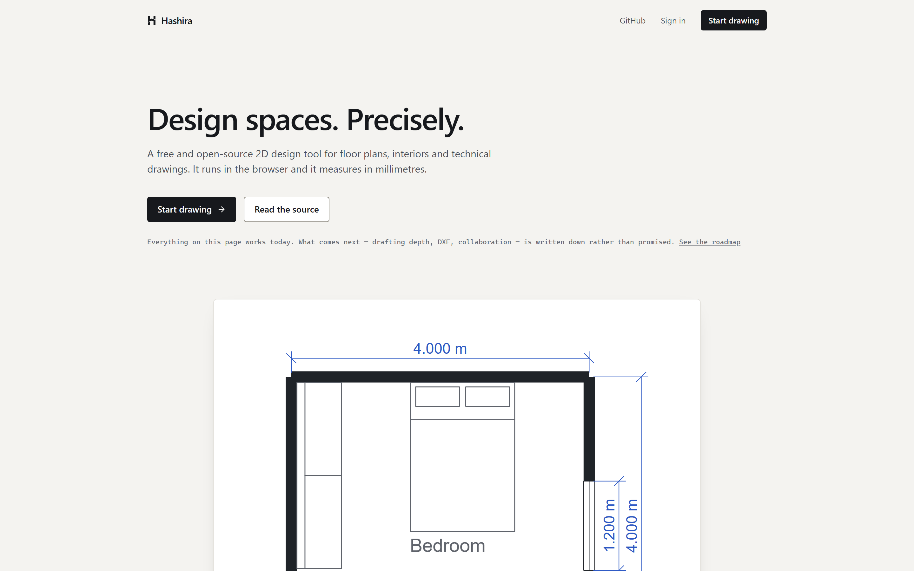

<h1>Hashira</h1>

**Design spaces. Precisely.**

A free and open-source 2D design tool for floor plans, interiors and technical drawings —
in the browser.

> **Status: the MVP works end to end.** You can create an account, draw a plan with walls,
> doors, windows and furniture, type exact values, snap, dimension it, label it, organise
> layers, undo, have it saved, reopen it, export it and share a read-only link. Everything
> past that — dimension chains, DXF, collaboration, 3D — is recorded in the
> [roadmap](docs/roadmap.md) and is deliberately not here yet.

---

## What it is

Hashira is a drafting tool, not a diagram editor. Walls have thickness and produce real
poché, and they mitre where they meet. Doors and windows belong to a wall and cut an opening
in it. A room is found from the walls around it rather than traced by hand. Measurements —
chains, angles, radii — store what they measure and never the number, so a drawing cannot
come to say one length while showing another. Everything is in millimetres and can be set by
typing an exact value, not only by dragging. Drawings export as vectors at a real scale on a
real page size.

It is deliberately small. There is no 3D, no BIM, no AI, no DWG. There is one thing —
drawing an accurate 2D plan — done properly.

## Screenshots



<p align="center"><em>The editor. Walls carry thickness, the door and window cut real
openings in the wall that hosts them, and the dimensions are read off the geometry rather
than typed.</em></p>



<p align="center"><em>Projects. One drawing each.</em></p>



<p align="center"><em>The landing page. The plan on it is not an illustration of the editor —
it is the sample plan, put through the editor's own SVG exporter.</em></p>

All three are generated rather than captured by hand: `npm run artwork` drives a headless
Chrome against a local instance — signed out for the landing page, signed in as the demo
account for the rest — and re-exports the landing page's drawing while it is there, so none
of it can quietly fall out of date. It needs the app running and a seeded database; set
`APP_URL` if it is not at `http://hashira.test`, and `CHROME_PATH` if Chrome is somewhere
unusual.

## Stack

|             |                                                                                |
| ----------- | ------------------------------------------------------------------------------ |
| Frontend    | React, TypeScript, Vite, Tailwind CSS                                          |
| Editor core | Plain TypeScript — no React in the document, geometry or command layers        |
| Rendering   | Canvas 2D for the viewport; one scene, serialised to SVG, PNG, PDF and DXF     |
| Backend     | Laravel 13, PHP 8.4, REST, session authentication with CSRF                    |
| Database    | PostgreSQL — relational metadata, JSONB for the drawing itself                 |
| Tests       | Vitest + Testing Library on the front, Pest on the back, Playwright end to end |
| CI          | GitHub Actions                                                                 |

Local development targets [Laravel Herd](https://herd.laravel.com), which already provides
PHP, Nginx and PostgreSQL. Containers are how it is **deployed**, not how it is developed: a
contributor never has to build an image, and the image never has to be a development
environment.

## Running your own

One machine, one `docker compose up`, and it obtains its own certificate:

```bash
git clone https://github.com/AlanDelValle/hashira.git
cd hashira
cp .env.production.example .env   # set your domain, a database password and an APP_KEY
docker compose up -d
```

[`docs/self-hosting.md`](docs/self-hosting.md) is the whole of it — backups, upgrades, turning
on presence, and what to do when a certificate will not issue. It runs on a free-tier instance;
the only thing self-hosting costs is the domain name.

## Running it locally

**Requirements:** Laravel Herd (PHP 8.3+), Node 22+, PostgreSQL 15+.

```bash
git clone https://github.com/AlanDelValle/hashira.git
cd hashira
composer install
npm install
cp .env.example .env
php artisan key:generate
```

Create the database and point `.env` at it:

```bash
createdb hashira
```

```dotenv
DB_CONNECTION=pgsql
DB_HOST=127.0.0.1
DB_PORT=5432
DB_DATABASE=hashira
DB_USERNAME=postgres
DB_PASSWORD=
```

Then:

```bash
php artisan migrate --seed
npm run dev
```

Herd serves the directory automatically at `http://hashira.test`. Without Herd,
`php artisan serve` works the same way at `http://localhost:8000` — set `APP_URL` to match.

The seeder creates a demo account and a sample plan:

```
demo@hashira.test  ·  password
```

## Architecture

The full reasoning lives in [`docs/architecture.md`](docs/architecture.md). The short
version is one rule:

> The drawing is not React state. The document, the geometry and the commands that mutate
> it are plain TypeScript. React renders the chrome around the drawing; it never owns it.

Which gives:

- a document model that is serialisable, versioned and testable without a DOM —
  [`docs/document-format.md`](docs/document-format.md);
- a command layer that makes undo/redo correct by construction rather than by remembering
  to snapshot;
- a snapping engine that is a single pipeline stage, not logic scattered through components;
- a canvas renderer where dragging a wall across a large plan causes zero React renders.

Documentation index:

| Document                                      | What is in it                                          |
| --------------------------------------------- | ------------------------------------------------------ |
| [architecture.md](docs/architecture.md)       | System shape, the decisions and why they were made     |
| [document-format.md](docs/document-format.md) | The drawing schema, versioning and migration rules     |
| [editor.md](docs/editor.md)                   | How the drawing surface is built                       |
| [geometry.md](docs/geometry.md)               | The maths layer and its conventions                    |
| [data-model.md](docs/data-model.md)           | Database tables and the REST API surface               |
| [roadmap.md](docs/roadmap.md)                 | Phases, MVP scope and everything deliberately deferred |

## Roadmap

Phases 0 to 6 are done: discovery and specification, the foundation (auth, dashboard, CI),
the editor core, the architecture tools, history and persistence, export and sharing, and
polish. That is the MVP. Phase 7 is done on top of it: wall joins and cleanups, rooms found
from the walls that enclose them, chains and angular and radial dimensions and leaders, a
library that holds blocks you made, and PDF import to trace over.

Phase 8 is done: interchange. A drawing has sheets rather than one page size — each with its
own size, scale and view of the plan — a PDF prints as many of them as you like, with each
layer on its own page if you want the prints to lay over one another, DXF goes both ways at
full size, and a print carries a title block that says who drew it and which revision it is,
its notes and a legend of its layers down the side, and revision clouds to say what changed. Then collaboration, and only after
all of that the things people ask for first — 3D, BIM semantics, generative features. The
reasoning for that order, and everything deliberately excluded, is in
[`docs/roadmap.md`](docs/roadmap.md).

## Contributing

Contributions are welcome — see [CONTRIBUTING.md](CONTRIBUTING.md) for the workflow and
the code standards, and [CODE_OF_CONDUCT.md](CODE_OF_CONDUCT.md) for how we treat each
other. Good first issues are labelled as such once Phase 1 lands.

## Licence

[AGPL-3.0-or-later](LICENSE) for the application, [MIT](resources/js/editor/LICENSE) for the
editor core in `resources/js/editor/`. [LICENSING.md](LICENSING.md) says what that means in
practice.

The short version. **Running it yourself is free and stays free** — there is no edition of
Hashira with the drawing tools taken out of it, and there never will be; if this project ever
charges for anything it charges for operating an instance, not for drawing on one. **Running
it as a service other people use means publishing your changes**, which is the difference
between the AGPL and the MIT this was under until Phase 10: MIT additionally hands out the
right to run it as a competing service and give nothing back, and operating it is the only
way the project ever pays for itself. **The editor core stays permissive** — the document
model, geometry, commands, snapping, viewport and exporters can be lifted into anything,
including something closed, which was the whole of the original argument for MIT and is still
right about the part it was right about.

Contributions come in under the [DCO](https://developercertificate.org/) (`git commit -s`).
No CLA, no copyright assignment.

## Name

_Hashira_ (柱) is the Japanese word for a structural pillar or column — the vertical member
that holds a building up, and the reference line everything else in a traditional plan is
set out from. The alternatives considered were _Poché_, _Parti_, _Datum_ and _Planum_; the
reasoning is in [`docs/architecture.md`](docs/architecture.md). The name is provisional.

## Acknowledgements

Hashira is an independent project. It is inspired by the general direction of modern
browser-based design tools, but it is not affiliated with, derived from, or a clone of any
of them.
